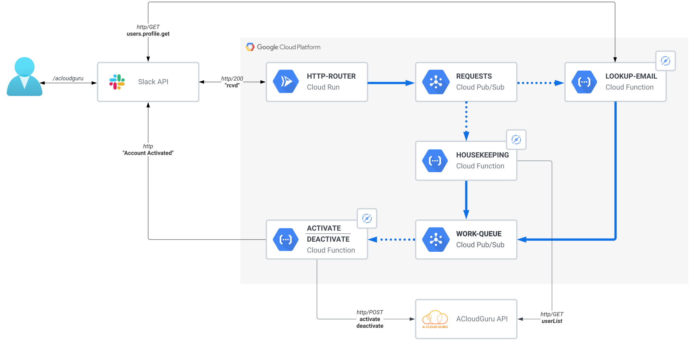

# README

## Overview

This project is a rewrite of the original [slackbot](github.com/cloudreach/acloudguru-slackbot)
serving the same purpose of automatically re-activating user accounts, initiated from Slack and
then processed using a serverless framework.

The reason for the rewrite is to achieve the following goals;

- Reduce nominal monthly costs
- Improve reportable metrics
- Implement trace logging for invidiual requests
- Improved scalability in the future

## Repo

### Summary

This repo is largely a monorepo design with all IaC and source code captured, here the only exception
is the REST client https://github.com/riweston/acloudguru-client-go/ which is maintained separately.

### HLD



The initial workflow is kicked from a user typing the command `/acloudguru` from Slack, this is then
forwarded via the Slack API to GCP where it is processed accordingly.

### Services

#### http-router

This service exists purely to handle the initial request from Slack, it must respond promptly or Slack
will timeout. After confirming receipt of the request it forwards on the following useful attributes
from the request for further processing

```shell
.user_id 			# This is the senders Slack ID, we'll use this later to lookup the senders email address
.response_url	# This gives us a unique identifier for logging additionally a URL to respond to our sender
```

These attributes are sent as a message to a pubsub topic for further processing

#### lookup-slack-id

This is a helper service to identify the email address of the sender using the Slack API. Using this
we're able to forward on the now identified email address to main pubsub work-queue, we use these
attributes

```shell
.user_email		# Email address, required by the ACloudGuru API for activation
.response_url	# Logging/response messages
.request_type	# This will just be 'activate' as we know any request from this service is an activation
```

#### house-keeping

This service is used is triggered from a new request coming through the request pubsub topic but
doesn't require any context. Using environment variables configured at runtime this service will
identify if there is capacity in the subscription or if the user(s) that haven't logged in for the
most amount of time, but still have an ACloudGuru license activated, must be deactivated so as not
to over-provision licenses.

In addition a variable is set to complete a housekeeping exercise that _any_ users who haven't logged
in within a given number of days will also have their accounts deactivated.

```shell
DAYS_CAP=			# Number of days since logging in before marking for deactivation
LICENSE_CAP=	# Number of licences before marking oldest accounts for deactivation
```

The `DAYS_CAP` variable is processed first to reduce the number of activated accounts, if this still
doesn't bring the total number of licenses allocated below the `LICENSE_CAP` threshold then process
this too.

Once the accounts for deactivation have been identified, they're sent on to the pubsub topic work-queue.

#### activate-deactivate

This service performs a few different tasks based on the `.request_type` attribute in the pubsub message.
`activate || deactivate` are the 2 expected values, deactivate is relatively straightforward and for
each user account a call is made to the ACloudGuru API. Activate works the same way but additionally
the original sender is also sent a confirmation message over Slack using the `.request_url` attribute.
